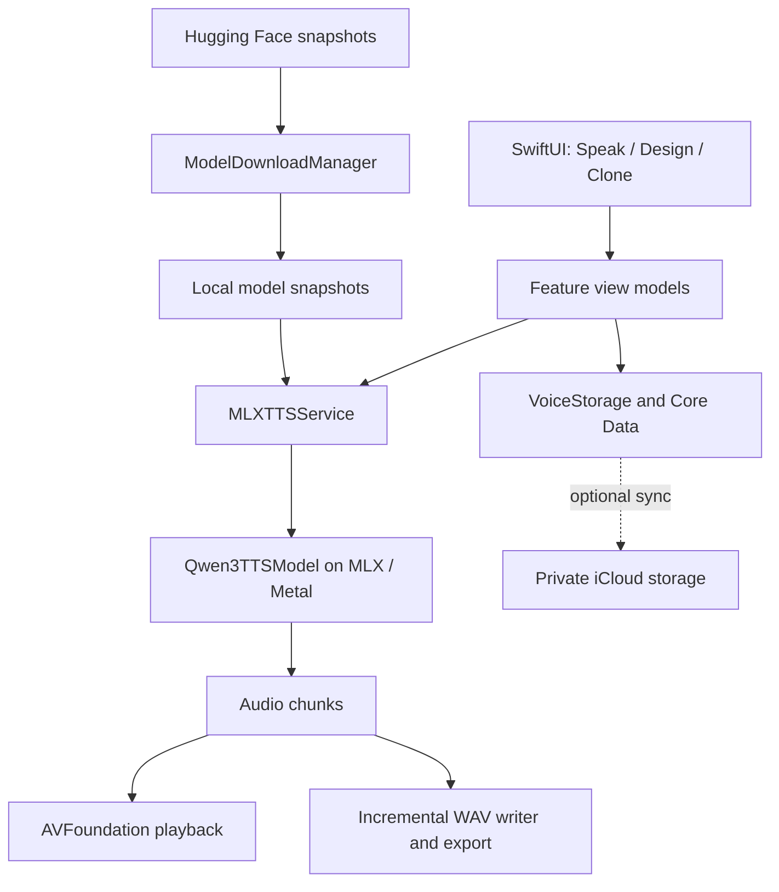

<p align="center">
  
</p>

# PolyJuiceVoice

PolyJuiceVoice is Team AER's macOS-first text-to-speech studio, with an iOS target. It runs Qwen3-TTS locally with Swift, Apple's MLX and Metal: speak with preset voices, design a voice from a description, or clone a voice from a reference recording.

**Requirements:** Apple silicon Mac with macOS 26+, or a physical iOS 26+ device with enough memory for your selected model. The iOS Simulator is not a supported inference target. Model downloads require an internet connection and gigabytes of free storage; generation uses installed models locally.

[Landing page source](https://github.com/Team-AER/aer-landing/tree/main/polyjuicevoice) · [Build and run](docs/BUILD_AND_RUN.md) · [Architecture](docs/PRD.md) · [Privacy](docs/PRIVACY_POLICY.md) · [Issues](https://github.com/Team-AER/PolyJuiceVoice/issues)

## What you can do

| Area | Workflow |
|---|---|
| **Speak** | Enter text, select a preset or saved voice, and generate audio. Presets accept an optional style instruction. |
| **Design** | Describe a new voice, generate a sample, and save the description as a reusable voice. Requires a VoiceDesign snapshot. |
| **Clone** | Record at least three seconds of speech or import an audio file, enter its matching transcript and new text, and generate with a Base snapshot. Save the reference for reuse. |
| **Library** | Search, filter, rename and delete saved cloned/designed voices, then select them for Speak. |
| **Playback and export** | Play generated audio, scrub through the waveform and export/share a 24 kHz mono WAV. |
| **Model Manager** | Download, select and delete capability-specific snapshots; inspect download progress and disk usage. |
| **Settings** | Manage microphone access, debug logs and optional iCloud voice-library sync. Changing sync requires a restart. |

The language picker offers English, Chinese, Japanese, Korean, Spanish, French and German. Model quality, latency and memory use vary with the selected family and precision; the repository does not establish a universal performance guarantee.

### Screenshots

| Speak | Design |
|---|---|
|  |  |

| Clone | Library |
|---|---|
|  |  |

## How it works



The registry includes 0.6B Base/CustomVoice and 1.7B Base/CustomVoice/VoiceDesign snapshots at supported 4-, 5-, 6-, 8-bit or bf16 precisions. Not every capability/family has every precision. Base supplies cloning; CustomVoice supplies presets; VoiceDesign supplies description-based voices. See [the registry](PolyJuiceVoice/Core/ML/ModelSnapshot.swift) for the actual matrix and download manifests.

Synthesis runs on-device. Hugging Face serves model downloads; enabling iCloud sync uploads saved voice metadata, reference recordings and embeddings to your private iCloud storage. Export/share sends audio where you choose. See the [privacy policy](docs/PRIVACY_POLICY.md) for those boundaries.

## Build from source

Use Xcode 26 or newer with the macOS/iOS 26 SDKs and Swift 6. The committed package lockfile records MLX Swift 0.29.1 and MLX Swift Examples 2.29.1.

```bash
git clone https://github.com/Team-AER/PolyJuiceVoice.git
cd PolyJuiceVoice
xcodebuild build \
  -project PolyJuiceVoice.xcodeproj \
  -scheme PolyJuiceVoice \
  -destination 'platform=macOS,arch=arm64'
```

Launch from Xcode, open Model Manager and download a snapshot for the mode you want to use. Models are downloaded separately, not committed to Git or delivered through Apple's On-Demand Resources. Current loading uses managed snapshot folders; the old `POLYJUICEVOICE_MODELS_DIR` override and two-folder FP16/decoder instructions no longer describe the runtime. See [the setup guide](docs/BUILD_AND_RUN.md) for physical iOS builds and troubleshooting.

## Landing page

The Team AER landing site includes a PolyJuiceVoice product page with mode walkthroughs, a studio UI demo, model/platform specifications and links to source and releases. Its browser demo illustrates the workflow; it is separate from the native MLX inference engine. The page lives in [aer-landing/polyjuicevoice](https://github.com/Team-AER/aer-landing/tree/main/polyjuicevoice); the earlier [standalone landing repository](https://github.com/Team-AER/polyjuicevoice-landing) remains separate from this app.

## Credits and license

PolyJuiceVoice is licensed under [MIT](LICENSE). Its inference implementation builds on [AtomGradient/swift-qwen3-tts](https://github.com/AtomGradient/swift-qwen3-tts), itself a Swift port of [Blaizzy/mlx-audio](https://github.com/Blaizzy/mlx-audio). Thank you to those projects, Apple's MLX team, Qwen and the mlx-community model contributors. The vendored source provenance and pinned upstream commit are recorded in [ATTRIBUTION.md](PolyJuiceVoice/Core/ML/MLX/Qwen3TTS/ATTRIBUTION.md). Model weights and dependencies retain their own licenses.
