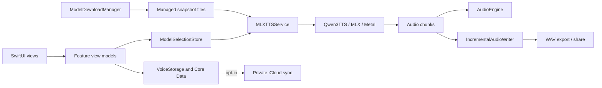

# PolyJuiceVoice product and architecture

This document describes the current repository, replacing the earlier iOS-only requirements and conversion-era plan. It is not a release certification or a performance benchmark.

PolyJuiceVoice is a native, macOS-first voice studio maintained by Team AER, with an iOS target. Its SwiftUI interface exposes Speak, Design, Clone, Library and Settings. The user-facing workflows and screenshots are in the [README](../README.md); build requirements are in [Build and run](BUILD_AND_RUN.md).

## Product capabilities

- Speak text with preset speakers and style instructions, or reuse a saved voice.
- Design voices from descriptions with a VoiceDesign model and save the resulting description.
- Clone a recorded/imported reference with a Base model and a user-entered matching transcript; save reference audio and cached embeddings for reuse.
- Search, filter, rename and delete voice-library entries.
- Play generated audio and export/share 24 kHz mono WAV files.
- Manage capability-specific model snapshots and inspect disk usage/debug logs.
- Opt into private iCloud voice-library sync, with a restart required after changing the setting.

The language picker exposes seven languages. Snapshot quality and feasible memory use depend on the family, precision and device. The supported registry includes 18 snapshot combinations; it does not promise that every precision exists for every capability.

## Runtime responsibilities

| Component | Responsibility |
|---|---|
| `Features/*/ViewModels` | User actions, validation, progress and saved voice workflows |
| `ModelSnapshot` | Supported snapshot matrix and Hugging Face file manifests |
| `ModelDownloadManager` / `ModelSelectionStore` | Download validation, managed storage and selected model per capability |
| `MLXTTSService` | Load the selected model, route capabilities and produce audio chunks |
| Vendored `Qwen3TTS` | Model, codec and speaker-encoder implementation using MLX/Metal |
| `AudioEngine` / `IncrementalAudioWriter` / `AudioExporter` | Playback and WAV writing/export |
| `VoiceStorage` / `CoreDataStack` | Voice metadata and reference/embedding persistence; optional iCloud storage |

Synthesis loads one snapshot at a time and releases the prior model when switching. Cloning uses reference audio and transcript through the Base model's speech tokenizer; it is not the old voice-design fallback. Reference recordings require at least three seconds. Transcripts are entered manually; the current app does not implement automatic Speech-framework transcription.

## Boundaries and related projects

Inference is local. Downloads contact Hugging Face, optional iCloud sync transfers saved voice assets and metadata, and export/share follows the user's destination choice. These boundaries are described in [Privacy](PRIVACY_POLICY.md).

The [central product landing page](https://github.com/Team-AER/aer-landing/tree/main/polyjuicevoice) presents the modes, UI demo, specifications and release/source links. Its demo is separate from native inference. The older [standalone landing repository](https://github.com/Team-AER/polyjuicevoice-landing) has its own lifecycle.

The [ODR plan](ODR_IMPLEMENTATION_PLAN.md) is historical and unimplemented. Current downloads use Hugging Face safetensors snapshots, not NPZ/PKL assets. See [upstream attribution](../PolyJuiceVoice/Core/ML/MLX/Qwen3TTS/ATTRIBUTION.md) and the app's [MIT license](../LICENSE).
